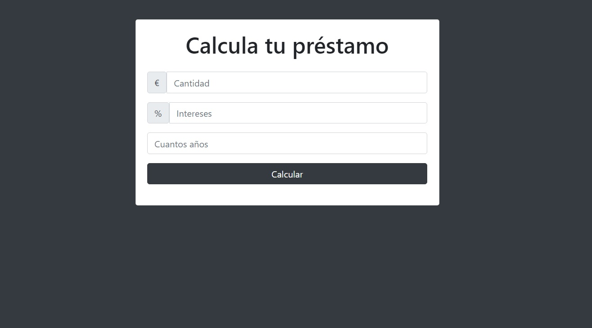

# calcular-interes.github.io

## Objetivo
+ Calcular prestamos según intereses y años
+ Según los años introducidos se calcula distinto interes.
+ Validar que todos los campos tienen datos.

### Visita el proyecto.

[Visita el proyecto](https://miguelpl32.github.io/calcular-interes.github.io/)

## Tecnologías
+ JavaScript
